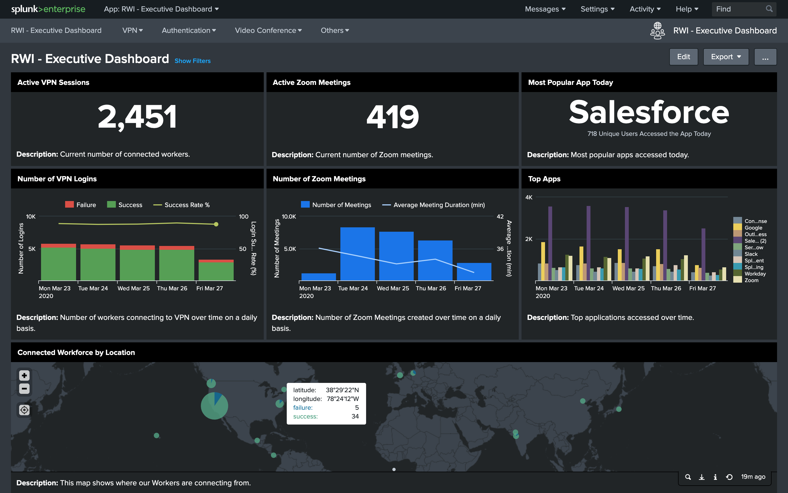

# Remote Work Insights - Executive Dashboard
## Introduction
The purpose of the **Remote Work Insights - Executive Dashboard** is to provide the ability to aggregate information across VPN, authentication, and video conferencing services to provide insights into the connectivity, productivity, and engagement across a remote workforce. An example dashboard that synthesizes information across these services is illustrated below:

**Dashboard Reference**: [RWI - Executive Dashboard (rw_exec.xml)](default/data/ui/views/rw_exec.xml)

The first row provides real-time information on the number of workers connected via VPN, real-time number of active Zoom video conferencing meetings, and the top application accessed via Okta for the current day. The second row looks at aggregate daily statistics over time for these same mission-critical indicators: number of VPN logins, number of Zoom meetings and average duration, and top 10 apps accessed via Okta. The bottom of the panel shows VPN connectivity counts by geographic location.

This document provides step by step instructions to install and configure your own Remote Work Executive Dashboard. It will allow you to dynamically create dashboards similar to the image above for a specific set of service providers: Palo Alto Network’s GlobalProtect VPN information, Okta authentication services, and Zoom video conferencing services. The instructions begin by highlighting a visual depiction of the data sources by service, a checklist of necessary Splunk Add-ons (commonly known as TAs) that must be installed, a runbook to ensure the proper Splunk Add-ons are correctly in place and finally a summary of steps required to start sending Zoom data to Splunk. 

Check out the [**runbook**](RUNBOOK.md) for details!

## Dashboards Reference
* See [Runbook: RWI - Executive Dashboard](RUNBOOK.md#remote-work-executive-dashboard)

## Latest Updates
* See [Changelog](CHANGELOG.md)