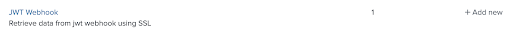
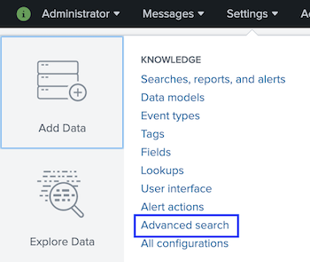
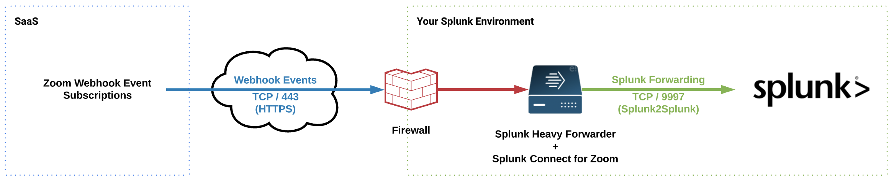
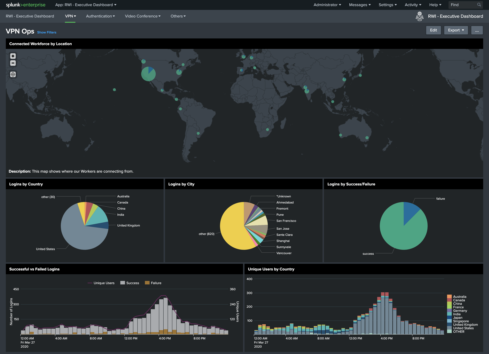
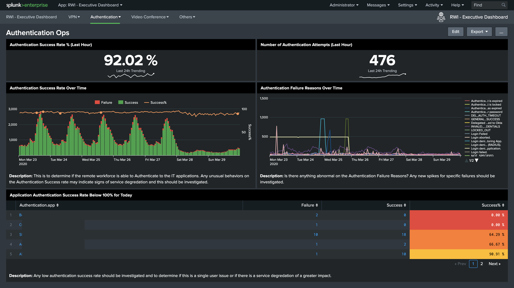

# Remote Workforce
# Introduction
The purpose of the Remote Workforce Dashboards is to provide the ability to aggregate information across VPN, authentication, and video conferencing services to provide insights into the connectivity, productivity, and engagement across a remote workforce. An example dashboard that synthesizes information across these services is illustrated below:

**Dashboard Reference**: [Remote Workforce (rw_exec.xml)](default/data/ui/views/rw_exec.xml)

The first row provides real-time information on the number of workers connected via VPN, real-time number of active Zoom video conferencing meetings, and the top application accessed via Okta for the current day. The second row looks at aggregate daily statistics over time for these same mission-critical indicators: number of VPN logins, number of Zoom meetings and average duration, and top 10 apps accessed via Okta. The bottom of the panel shows VPN connectivity counts by geographic location.

This document provides step by step instructions to install and configure your own  Remote Workforce Dashboards. It will allow you to dynamically create dashboards similar to the image above for a specific set of service providers: Palo Alto Network’s GlobalProtect VPN information, Okta authentication services, and Zoom video conferencing services. The instructions begin by highlighting a visual depiction of the data sources by service, a checklist of necessary Splunk Add-ons (commonly known as TAs) that must be installed, a runbook to ensure the proper Splunk Add-ons are correctly in place and finally a summary of steps required to start sending Zoom data to Splunk. 

## Example of Remote Workforce Data Collection

# Checklist
This section provides you the prerequisites to successfully install the Remote Workforce Dashboards.

## Splunk Applications
Download the following apps from Splunkbase.com and deploy them according to your Splunk Environment. For more information on how to deploy Splunk apps and addons refer to the [App Deployment Overview](https://docs.splunk.com/Documentation/Splunk/latest/Admin/Deployappsandadd-ons).

* Remote Workforce Dashboards
* Palo Alto Networks 
  * [Palo Alto Networks Add-on for Splunk](https://splunkbase.splunk.com/app/2757/)
  * [Palo Alto Networks App for Splunk](https://splunkbase.splunk.com/app/491/)
* Okta 
  * [Splunk Add-on for Okta](https://splunkbase.splunk.com/app/2806/)
  * [Okta Identity Cloud Add-on for Splunk](https://splunkbase.splunk.com/app/3682/)
* Zoom
  * [Splunk JWT Webhook Modular Input Add-on](https://github.com/splunk/jwt_webhook)

## Splunk Intrastructure
* Single Instance
  * Any Splunk Enterprise version 7.3 or higher
    * For more information about which Splunk Deployment si right for you see [About Splunk Enterprise deployments](https://docs.splunk.com/Documentation/Splunk/8.0.2/Overview/AboutSplunkEnterprisedeployments)

**OR**
* Distributed Splunk Deployment + Splunk Heavy Forwarder
  * Any full version Splunk Enterprise version 7.3 or higher that will act as an independent forwarding agent for your Zoom and OKTA data source
  * Network and OS Firewall whitelist permissions

**AND**
* Syslog server for Palo Alto TA
  * For more information on how to configure syslog
    * [Splunk Connect for Syslog](https://splunk-connect-for-syslog.readthedocs.io/en/master/gettingstarted/)
      * [Runbook for Redhat 8](https://splunk-connect-for-syslog.readthedocs.io/en/master/gettingstarted/podman-systemd-general/)

## Permissions Requirements
* Splunk Environment
  * Splunk admin account with ability to install/configure apps and create indexes
  * Splunk CLI (Command Line) access
* Zoom Environment
  * Zoom administrator or developer account
  * Zoom permissions to create and activate a Zoom App
  * Network and OS Firewall whitelist permissions
  * (Optional) Signed Trusted CA SSL Certificate and Private Key

# Runbook Summary
In this runbook, you need to complete the following items:

## Install Splunk Apps
* Splunk Search Head
  * Remote Workforce
    * Remote Workforce Dashboards
  * Palo Alto Networks
    * [Palo Alto Networks Add-on for Splunk](https://splunkbase.splunk.com/app/2757/)
    * [Palo Alto Networks App for Splunk](https://splunkbase.splunk.com/app/491/)
  * Okta
    * [Splunk Add-on for Okta](https://splunkbase.splunk.com/app/2806/)
* Splunk Heavy Forwarder
  * Okta
    * [Okta Identity Cloud Add-on for Splunk](https://splunkbase.splunk.com/app/3682/)
  * Zoom
    * [Splunk JWT Webhook Modular Input Add-on](https://github.com/splunk/jwt_webhook)

## Create Splunk Indexes
* Palo Alto Networks
  * `index=pan`
* Okta
  * `index=okta`
* Zoom
  * `index=zoom`

## Configure Data Models
* Update Palo Alto Networks Firewall Logs Data Model Schema
  * Prefix `index=pan` in the base search
* Enabled Data Model Acceleration (DMA) (Optional)
  * Palo Alto Networks Add-on for Splunk
    * Palo Alto Networks Firewall Logs

## Configure Data Collections
* Okta
  * Configure Okta Identity Cloud Add-on for Splunk and collecting Okta events
* Zoom
  * Configure Splunk JWT Webhook Modular Input Add-on to receive Zoom Webhook events 
    * Step by step instructions included in this section: [Configure Splunk JWT Webhook Modular Input Add-On](#Configure-Splunk-JWT-Webhook-Modular-Input-Add-On)

## Create Zoom Webhook (Zoom only)
* Zoom Webhook Only App created
* Enable Webhook event subscriptions
* Activate Zoom App

## Configure Remote Workforce App
* Configure indexes macros
  * Authentication: rw_auth_indexes
    * Eg: (index=okta)
  * Video Conferencing: rw_vc_indexes
    * Eg: (index=zoom)
  * VPN: rw_vpn_indexes
    * Eg: (index=pan)

# Zoom Walkthrough

## Configure Splunk JWT Webhook Modular Input Add-on
This section is only applicable to Zoom Data Collection.

* Ensure your environment allows incoming traffic from the Zoom Webhook Event Services. Work with your Network Administrator to whitelist the following network subnets. For more details on [Network Firewall or Proxy Server Settings for Zoom](https://support.zoom.us/hc/en-us/articles/201362683-Network-Firewall-or-Proxy-Server-Settings-for-Zoom) and feel free to contact the Zoom directly for additional assistance.
    * 18.205.93.128/25
    * 52.202.62.192/26
    * 3.80.20.128/25
    * 3.208.72.0/25
    * 3.211.241.0/25
* Install [Splunk JWT Webhook Modular Input Add-on](https://github.com/splunk/jwt_webhook) on a Splunk Heavy Forwarder (Single Instance Deployments can use the same instance)
* From the Splunk Web Interface, go to **Settings > Data Inputs**

* Click **Add New** for the **JWT Webhook** input

* Fill the parameters as per the table below or you may enter specific value as per your environment. 
**Note:**
* The JWT Webhook Add-On leverages the default Splunk Web self-signed certificate and private key as described here: [About securing Splunk Enterprise with SSL](https://docs.splunk.com/Documentation/Splunk/latest/Security/AboutsecuringyourSplunkconfigurationwithSSL). For security reasons and best practices, it is recommended to use Trusted CA Signed SSL Certificates. You may follow this documentation to assist you with generating the needed certificates for your trusted CA: [How to get certificates signed by a third-party](https://docs.splunk.com/Documentation/Splunk/latest/Security/Howtogetthird-partycertificates). 
* For the purpose of this document, we will use the default certificates that were shipped with Splunk to help you understand the setup process. The default certificates are located here
  * `$SPLUNK_HOME/etc/auth/splunkweb/cert.pem`
  * `$SPLUNK_HOME/etc/auth/splunkweb/privkey.pem`
* If you wish to use your own SSL certificates, we recommend storing your certificate and private key in the following directory: `$SPLUNK_HOME/etc/auth/<your_folder>`

| Parameter | Value |
| --- | --- |
| Name | Zoom |
| Secret | Leave Empty |
| Port| 4443 |
| Path | Leave Empty |
| SSL Certificate File | etc/auth/splunkweb/cert.pem |
| SSL Certificate Key File | etc/auth/splunkweb/privkey.pem |
| Password | Leave Empty |
| Set sourcetype | Manual |
| Sourcetype | zoom:webhook |
| Host | Leave as is |
| Index | zoom |

* Click the ***Next*** button and this should complete the Input setup.

## Create Zoom Webhook Only App
* Go to: [https://marketplace.zoom.us/](https://marketplace.zoom.us) and login
* On the top right corner, click ***Develop > Build App***

* ***Create*** a Webhook Only App

* Fill the App Information and click Continue
  * App Name
  * Short Description
  * Company Name
  * Developer Name
  * Developer Email Address

 

* Enable ***Event Subscriptions***

* Click on ***Add new event subscription*** button

* Provide the following information
  * Subscription Name (eg: Splunk)
  * Event notification endpoint URL (eg: https://example.com:4443)

* Click on ***Add events*** button

* Subscribe to any Webhook Events you wish. For more details, please visit the [Zoom Webhook Reference page](https://marketplace.zoom.us/docs/api-reference/webhook-reference).

* Click ***Save***

* Click ***Continue***
* Activate your newly created Webhook Only App

## Configure the Splunk Remote Workforce App
* From the Splunk Search Head, go to the ***Remote Workforce*** App

* Go to ***Settings > Advanced Search > Search Macros*** to update the Index Macros

* Update the following indexes macros
  * Authentication: rw_auth_indexes
    * (index=okta)
  * Video Conferencing: rw_vc_indexes
    * (index=zoom)
  * VPN: rw_vpn_indexes
    * (index=pan)

# Additional Resources

## Splunk Docs
* [App deployment overview](https://docs.splunk.com/Documentation/Splunk/latest/Admin/Deployappsandadd-ons)
* [Install an add-on in a single-instance Splunk Enterprise deployment](http://docs.splunk.com/Documentation/AddOns/released/Overview/Singleserverinstall)
* [About securing Splunk Enterprise with SSL](https://docs.splunk.com/Documentation/Splunk/latest/Security/AboutsecuringyourSplunkconfigurationwithSSL)
* [How to get certificates signed by a third-party](https://docs.splunk.com/Documentation/Splunk/latest/Security/Howtogetthird-partycertificates)
* [Splunkbase](https://splunkbase.splunk.com/)
* [Splunk Connect for Syslog](https://splunk-connect-for-syslog.readthedocs.io/en/master/gettingstarted/)
* [Splunk Connect for Syslog - Runbook for redhat 8](https://splunk-connect-for-syslog.readthedocs.io/en/master/gettingstarted/podman-systemd-general/)

## Splunk JWT Webhook Add-on Support
* [https://github.com/splunk/jwt_webhook/issues](https://github.com/splunk/jwt_webhook/issues)

## Zoom References
* [Zoom Network Firewall or Proxy Server Settings](https://support.zoom.us/hc/en-us/articles/201362683-Network-Firewall-or-Proxy-Server-Settings-for-Zoom)
* [Zoom Marketplace](https://marketplace.zoom.us/)
* [Zoom Webhook Logs](https://marketplace.zoom.us/user/logs?type=WebhookOnly)
* [Zoom Webhook Documentation](https://marketplace.zoom.us/docs/guides/tools-resources/webhooks)
* [Zoom Developer Forum](https://devforum.zoom.us/)

# Appendix

## Zoom Webhook Data Flow Diagram

# Remote Workforce Dashboards
## Remote Workforce Home Dashboard

**Dashboard Reference**: [rw_exec.xml](default/data/ui/views/rw_exec.xml)

The first row of the Remote Workforce Dashboard provides real-time information on the number of workers connected via VPN, real-time number of active Zoom meetings, and the top application accessed via Okta for the current day. The second row enables us to look at aggregate daily statistics over time for these same mission-critical indicators: number of VPN logins, number of Zoom meetings and average duration, and top 10 apps accessed via Okta. The bottom of the panel shows VPN connectivity counts by geographic location. Sudden drops during working hours may indicate connectivity issues.

The combination of VPN, authentication, and video conferencing services will provide insight into the following questions for a remote workforce:
* Is our remote workforce connected?
* Are they able to stay productive and run the business? 
* Are they engaging with each other? 

## VPN Ops Dashboard

**Dashboard Reference**: [rw_vpn_gp_logins.xml](default/data/ui/views/rw_vpn_gp_logins.xml)

The top panel of the VPN Ops Dashboard shows successful and failed login attempts by location. The middle sequence of pie charts provides more specific information by country and city, as well as an overall indicator of successful and failed login attempts. The bottom row provides a time history of login attempts and insight into the number of unique users logging in to the network, and also a more granular view of users by regional gateways.

## Zoom Ops Dashboard

**Dashboard Reference**: [rw_vc_zoom_ops.xml](default/data/ui/views/rw_vc_zoom_ops.xml)

The top row of the Zoom Ops dashboard displays real time Zoom statistics: number of current active video conferencing sessions, number of active participants, duration of the longest ongoing meeting, average meeting length, and shortest meeting in the last 1 hour. The middle row shows the number of meetings over time by hour and whether meetings are completed in the scheduled amount of time or run over to provide insight into the distribution of activity over the course of a day. The bottom row shows the number of meetings by type and also indicates the distribution of devices that were used to join Zoom.

## Authentications Ops Dashboard

**Dashboard Reference**: [rw_auth_ops.xml](default/data/ui/views/rw_auth_ops.xml)

The top row of the Authentication Ops dashboard provides real time authentication information for applications accessed via Okta: the success rate and the number of authentication attempts over the last hour. The middle row provides these same metrics over the past seven days, and indicates the reasons for failure. The bottom panel indicates the authentication success rate by application.
