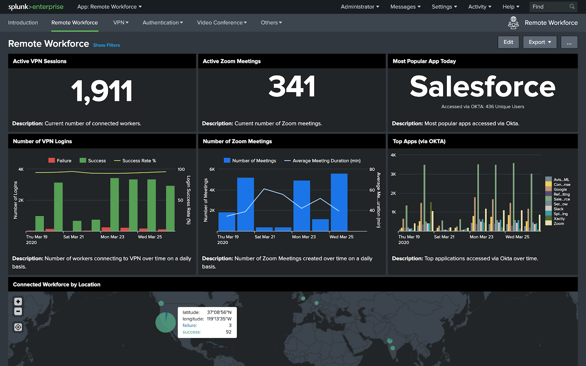
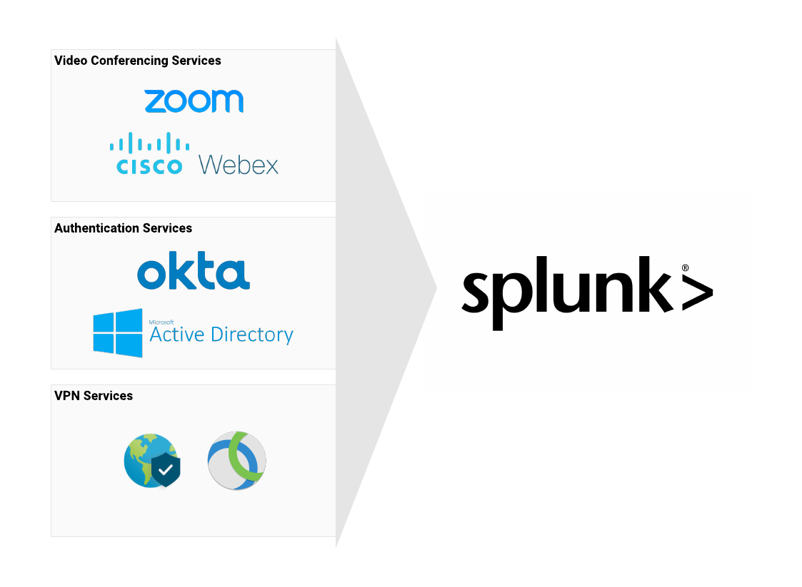

# Remote Workforce
# Introduction
The purpose of the Remote Workforce Dashboards is to provide the ability to aggregate information across VPN, authentication, and video conferencing services to provide insights into the connectivity, productivity, and engagement across a remote workforce. An example dashboard that synthesizes information across these services is illustrated below:

The first row provides real-time information on the number of workers connected via VPN, real-time number of active Zoom video conferencing meetings, and the top application accessed via Okta for the current day. The second row looks at aggregate daily statistics over time for these same mission-critical indicators: number of VPN logins, number of Zoom meetings and average duration, and top 10 apps accessed via Okta. The bottom of the panel shows VPN connectivity counts by geographic location.

This document provides step by step instructions to install and configure your own  Remote Workforce Dashboards. It will allow you to dynamically create dashboards similar to the image above for a specific set of service providers: Palo Alto Network’s GlobalProtect VPN information, Okta authentication services, and Zoom video conferencing services. The instructions begin by highlighting a visual depiction of the data sources by service, a checklist of necessary Splunk Add-ons (commonly known as TAs) that must be installed, a runbook to ensure the proper Splunk Add-ons are correctly in place and finally a summary of steps required to start sending Zoom data to Splunk. 

## Example of Remote Workforce Data Collection

# Checklist
This section provides you the prerequisites to successfully install the Remote Workforce App.

## Splunk Applications
Download the following apps from Splunkbase.com and deploy them according to your Splunk Environment. For more information on how to deploy Splunk apps and addons refer to the [App Deployment Overview](https://docs.splunk.com/Documentation/Splunk/latest/Admin/Deployappsandadd-ons).

* Remote Workforce App
  * Remote Workforce App
* Palo Alto Networks 
  * [Palo Alto Networks Add-on for Splunk](https://splunkbase.splunk.com/app/2757/)
  * [Palo Alto Networks App for Splunk](https://splunkbase.splunk.com/app/491/)
* Okta 
  * [Splunk Add-on for Okta](https://splunkbase.splunk.com/app/2806/)
  * [Okta Identity Cloud Add-on for Splunk](https://splunkbase.splunk.com/app/3682/)
* Zoom
  * [Splunk JWT Webhook Modular Input Add-on](https://github.com/splunk/jwt_webhook)

## Splunk Intrastructure
* Single Instance
  * Any Splunk Enterprise version 7.3 or higher
    * For more information about which Splunk Deployment si right for you see [About Splunk Enterprise deployments](https://docs.splunk.com/Documentation/Splunk/8.0.2/Overview/AboutSplunkEnterprisedeployments)

*OR*
* Distributed Splunk Deployment + Splunk Heavy Forwarder
  * Any full version Splunk Enterprise version 7.3 or higher that will act as an independent forwarding agent for your Zoom and OKTA data source
  * Network and OS Firewall whitelist permissions

*AND*
* Syslog server for Palo Alto TA
  * For more information on how to configure syslog
    * [Splunk Connect for Syslog](https://splunk-connect-for-syslog.readthedocs.io/en/master/gettingstarted/)
      * [Runbook for Redhat 8](https://splunk-connect-for-syslog.readthedocs.io/en/master/gettingstarted/podman-systemd-general/)

## Permissions Requirements
* Splunk Environment
  * Splunk admin account with ability to install/configure apps and create indexes
  * Splunk CLI (Command Line) access
* Zoom Environment
  * Zoom administrator or developer account
  * Zoom permissions to create and activate a Zoom App
  * Network and OS Firewall whitelist permissions
  * (Optional) Signed Trusted CA SSL Certificate and Private Key

# Runbook Summary
In this runbook, you need to complete the following items:

## Install Splunk Apps
* Splunk Search Head
  * Remote Workforce
    * Remote Workforce Dashboard
  * Palo Alto Networks
    * [Palo Alto Networks Add-on for Splunk](https://splunkbase.splunk.com/app/2757/)
    * [Palo Alto Networks App for Splunk](https://splunkbase.splunk.com/app/491/)
  * Okta
    * [Splunk Add-on for Okta](https://splunkbase.splunk.com/app/2806/)
* Splunk Heavy Forwarder
  * Okta
    * [Okta Identity Cloud Add-on for Splunk](https://splunkbase.splunk.com/app/3682/)
  * Zoom
    * [Splunk JWT Webhook Modular Input Add-on](https://github.com/splunk/jwt_webhook)

## Create Splunk Indexes
* Palo Alto Networks
  * index=pan
* Okta
  * index=okta
* Zoom
  * index=zoom

## Configure Data Models
* Update Palo Alto Networks Firewall Logs Data Model Schema
  * Prefix index=pan in the base search
* Enabled Data Model Acceleration (DMA) (Optional)
  * Palo Alto Networks Add-on for Splunk
    * Palo Alto Networks Firewall Logs

## Configure Data Collections
* Okta
  * Configure Okta Identity Cloud Add-on for Splunk and collecting Okta events
* Zoom
  * Configure Splunk JWT Webhook Modular Input Add-on to receive Zoom Webhook events 
    * Step by step instructions included in this section: [5.1. Configure Splunk JWT Webhook Modular Input Add-On](https://docs.google.com/document/d/12Z1VarKhfZM8le4aEbJs5WJWW9nivPaZ0qzrJRh5Q6o/edit#heading=h.w6ytwrsh0klc)

## Create Zoom Webhook (Zoom only)
* Zoom Webhook Only App created
* Enable Webhook event subscriptions
* Activate Zoom App

## Configure Remote Workforce App
* Configure indexes macros
  * Authentication: rw_auth_indexes
    * Eg: (index=okta)
  * Video Conferencing: rw_vc_indexes
    * Eg: (index=zoom)
  * VPN: rw_vpn_indexes
    * Eg: (index=pan)

# Zoom Walkthrough

## Configure Splunk JWT Webhook Modular Input Add-on

## Create Zoom Webhook Only App

# Additional Resources

## Splunk Docs
* [App deployment overview](https://docs.splunk.com/Documentation/Splunk/latest/Admin/Deployappsandadd-ons)
* [Install an add-on in a single-instance Splunk Enterprise deployment](http://docs.splunk.com/Documentation/AddOns/released/Overview/Singleserverinstall)
* [About securing Splunk Enterprise with SSL](https://docs.splunk.com/Documentation/Splunk/latest/Security/AboutsecuringyourSplunkconfigurationwithSSL)
* [How to get certificates signed by a third-party](https://docs.splunk.com/Documentation/Splunk/latest/Security/Howtogetthird-partycertificates)
* [Splunkbase](https://splunkbase.splunk.com/)
* [Splunk Connect for Syslog](https://splunk-connect-for-syslog.readthedocs.io/en/master/gettingstarted/)
* [Splunk Connect for Syslog - Runbook for redhat 8](https://splunk-connect-for-syslog.readthedocs.io/en/master/gettingstarted/podman-systemd-general/)

## Splunk JWT Webhook Add-on Support
* [https://github.com/splunk/jwt_webhook/issues](https://github.com/splunk/jwt_webhook/issues)

## Zoom References
* [Zoom Network Firewall or Proxy Server Settings](https://support.zoom.us/hc/en-us/articles/201362683-Network-Firewall-or-Proxy-Server-Settings-for-Zoom)
* [Zoom Marketplace](https://marketplace.zoom.us/)
* [Zoom Webhook Logs](https://marketplace.zoom.us/user/logs?type=WebhookOnly)
* [Zoom Webhook Documentation](https://marketplace.zoom.us/docs/guides/tools-resources/webhooks)
* [Zoom Developer Forum](https://devforum.zoom.us/)

# Appendix

## Zoom Webhook Data Flow Diagram

# Remote Workforce Dashboards

## Remote Workforce Home Dashboard

## VPN Ops Dashboard

## Zoom Ops Dashboard

## Authentications Ops Dashboard

